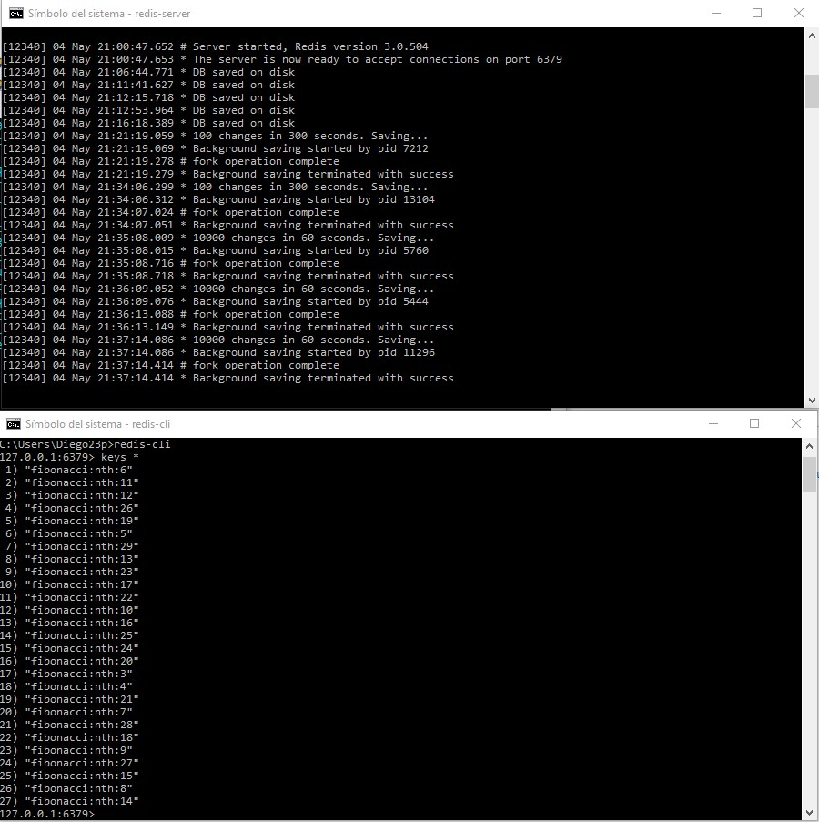
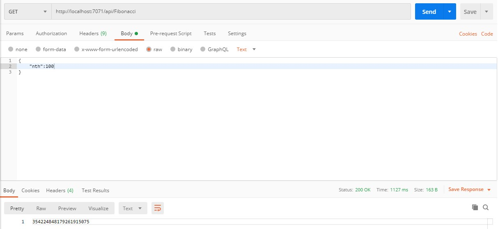
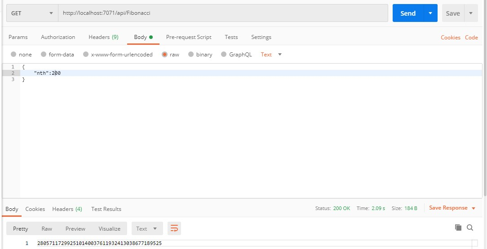
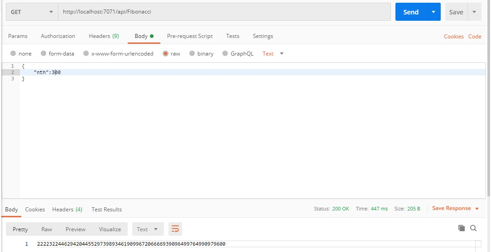
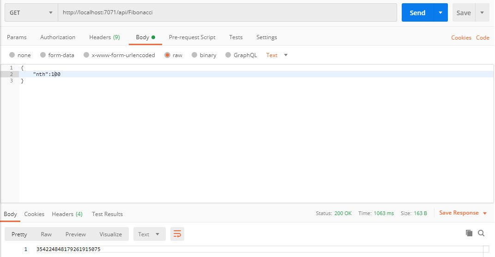
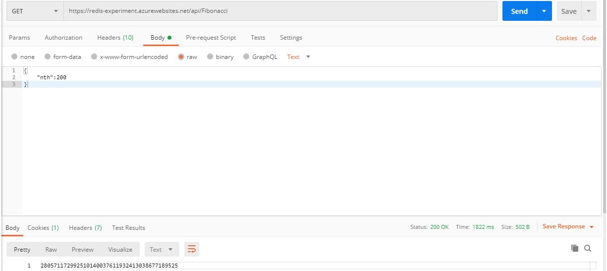
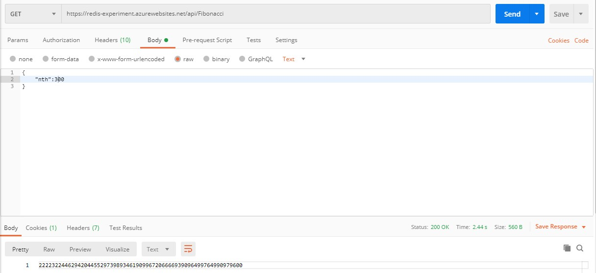
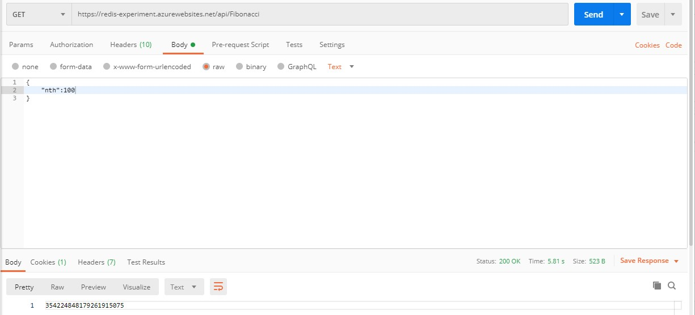
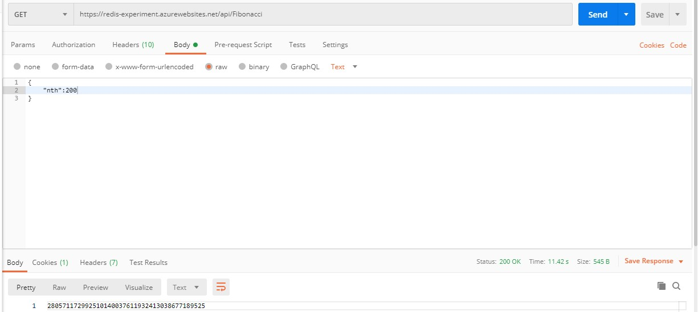
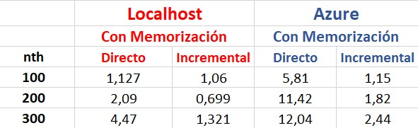

### Escuela Colombiana de Ingeniería
### Arquitecturas de Software - ARSW

## Fibonacci-Redis

### Autor:
- [Diego Puerto](https://github.com/Diego23p)

### Localhost:

Inicio del servidor y su cliente:

Ejecución de la función:

nth = 100 (incremental desde 0)

nth = 200 (incremental desde 100)

nth = 300 (incremental desde 200)

nth = 100 (directo)

nth = 200 (directo)

nth = 300 (directo)

### Azure:

nth = 100 (incremental desde 0)

nth = 200 (incremental desde 100)

nth = 300 (incremental desde 200)

nth = 100 (directo)

nth = 200 (directo)

nth = 300 (directo)

### Resumen

### Conclusuiones

- El factor más influyente es la memorización, debido a que el funcionamiento ya sea en Azure o localhost, incrementa en gran medida

- Cuando se realizan pruebas de manera incremental el factor de aumento es casi lineal cuando nth tambíen lo hace

- De forma incremental, la diferencia es mínima cuando se compara Azure y localhost, de forma directa sí se percibe una diferencia considerable